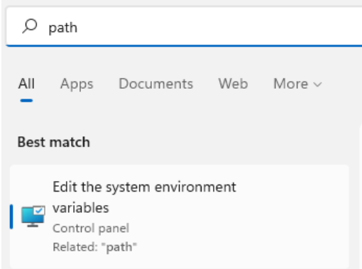
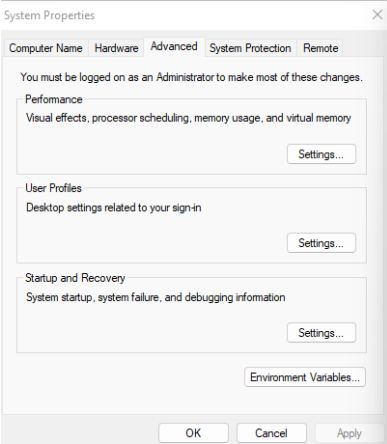
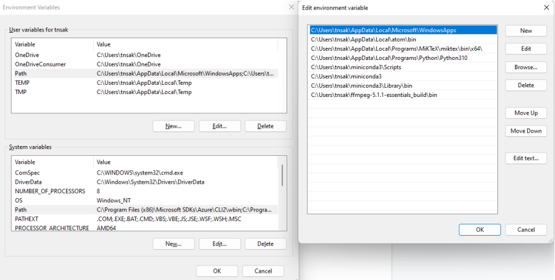
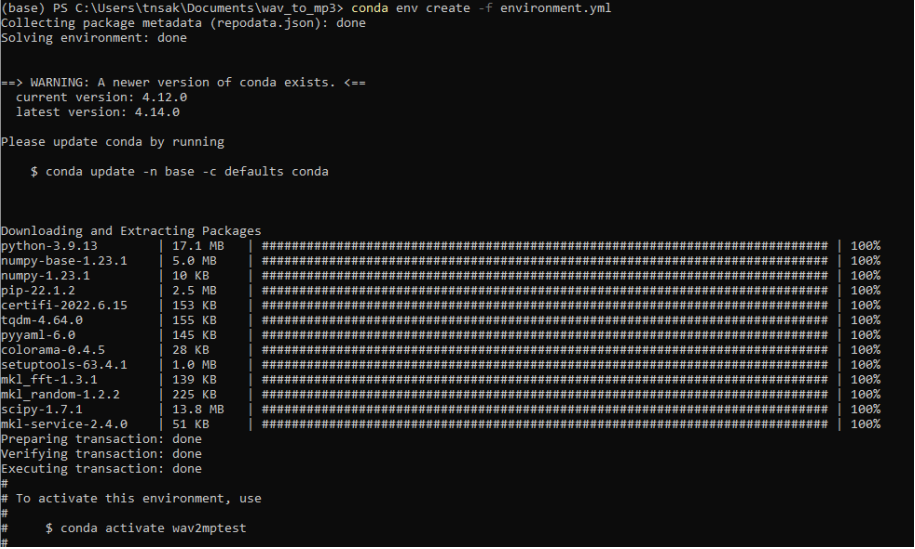
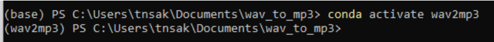
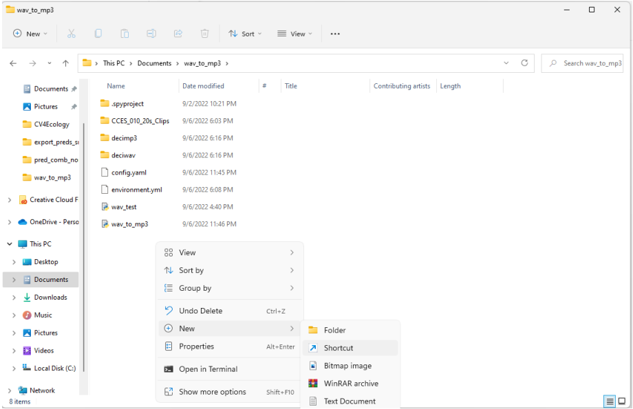
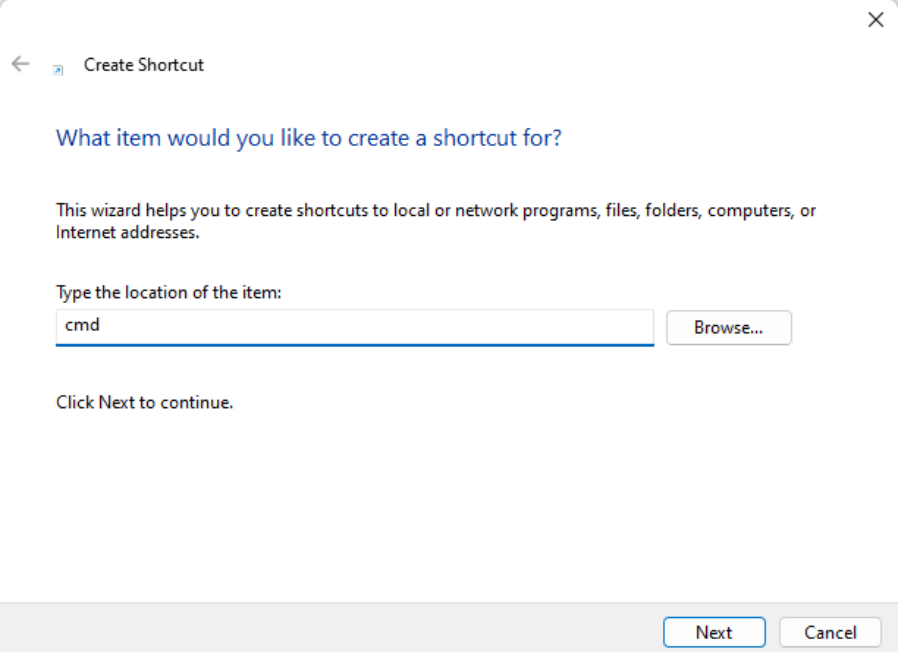
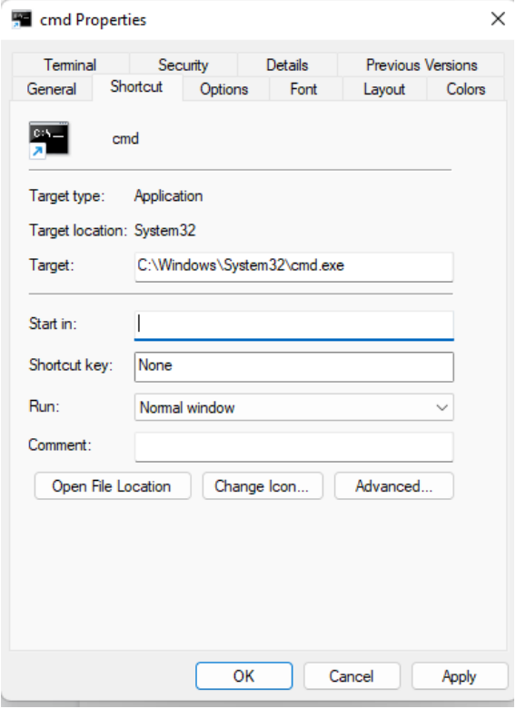

# wav2mp3

python tool for decimating and creating MP3s for Zooniverse project

wav2mp3  Installation and User Guide

**INSTALLATION**

First you will need to **install Python and Conda** (an environment / package manager for Python). I recommend using Miniconda here:

<https://docs.conda.io/en/latest/miniconda.html>

We also need to add the miniconda installation to our system path variable so that Windows knows where conda is. Search for "path" in the Windows search and select "Edit system environment variables"

Then click "Environment Variables..."

From here select "Path" under the top "User variables for..." section and click "Edit"

Click "New" and add the three miniconda3 paths you see in the image above. Check where your miniconda was installed (default should be **C:\\Users\\\<username\>\\miniconda3** ) add the paths **miniconda3**, **miniconda3\\Scripts**, and **miniconda3\\Library\\bin** with the appropriate start of the path for your particular installation. Click "OK" when you're done.

To check if this worked, you can run the command **conda** in a command prompt terminal (**cmd**) and it should print help info for conda. If you get an error instead, you may need to close and reopen cmd, or try restarting your computer if that still doesn't work.

Next we'll **pull the code from GitHub** - we'll do this from the command line using the command prompt because we'll need to use this later. Open cmd and navigate to the folder you want the code directory to be in using **cd** (so if you want C:/Documents/wav2mp3, go to C:/Documents), then enter the command

**git clone <https://github.com/TaikiSan21/wav2mp3.git>**

To pull the code from GitHub. Then **cd** into the new wav2mp3 directory that gets created. **\*NOTE\*** to pull future updates you only need to use **git pull,** but this may override your local **config.yaml** file!

Now we need to **install the appropriate Python packages,** we'll do this using **conda**. The GitHub repo contains an **environment.yml** file that lists all the required packages. We can create a new **conda environment** (see **Appendix I** "primer on conda & environments) using this file that will automatically install all the packages for us using the command

**conda env create -f environment.yml**

You should see something like this

If nothing has gone wrong, we're done!

**wav2mp3 USER GUIDE**

We'll run the code from the command line so first make sure you have a cmd open and navigate to the wav2mp3 folder we downloaded from GitHub. For convenience I recommend creating a cmd shortcut that always opens in this directory (see **Appendix II**) so that you don't have to **cd** to this directory every time. Next we'll **activate** the conda environment we created in the setup with **conda activate wav2mp3**. **\*NOTE\*** if this is your first time using conda, you may need to run the command **conda init cmd.exe** first, then restart your cmd prompt before doing this.

You'll know when you have activated an environment because you'll see the environment name in parentheses to the left of your command prompt.

Before we actually run the code, we need to set-up the parameters to tell it what files we want to process and set some other parameters. These are set in the file **config.yaml**, so first open that up (you can use RStudio or any other program that can edit text). This contains a number of parameters, here's what they do (there are also descriptive comments within the config file itself)

**in_dir** - The folder of wav files you want to process. Should be full path to a folder.

**out_mp3** - The folder to put the decimated mp3 files. Should be full path to a folder.

**out\_ wav** - The folder to put the decimated wav files. Should be full path to a folder.

**delete_wav** - True/False to delete the decimated wav files (not originals!) after processing. These will be created either way as an intermediate step, but if you don't need them then leave this as True. Note that in Python this needs to be True or False not TRUE or FALSE like R.

**mp3_sr_hz** - SR to decimate mp3 file to. Best to leave at default 44100.

**high_filt_hz** - Upper end of bandpass filter to apply. Uses order 4 butterworth.

**low_filt_hz** - Lower end of bandpass filter to apply. Uses order 4 butterworth.

**norm_type** - Code supports two types of normalization, 'fixed' and 'max'. 'fixed' adds the same dB value (**norm_value**) to each wav file. 'max' adjusts each file to the max value, here **norm_value** is how close (in dB) to get to max. E.g. **norm_value** 5 means 5dB less than max volume, higher numbers are quieter in this case.

**norm_value** - Usage described above

**channel** - Channel of wav file to use for mp3 and spectrogram

**do_plot** - True/False to create spectrogram PNGs

**spec_config** - a dictionary (uses {}, behaves like an R list) containing spectrogram plotting parameters

**nfft** - FFT length for spectrogram

**overlap** - percent overlap for slices

**width** - PNG width (pixels)

**height** - PNG height (pixels)

**zmin** - minimum level for plotting spectrogram. Values below this will be brought up to this value

**zmax** - same as above, but for max

**fmin** - frequency minimum for plot (Hz)

**fmax** - frequency maximum for plot (Hz)

**out_spec** - directory to place plots in. Should be full path to a folder.

**q_scale** - logical flag to scale images by quantile values instead of **zmin/zmax** above

**q** - upper and lower quantiles in square brackets [min_q, max_q] (both values ranging from 0-1). Works similar to the **zmin/zmax** scaling except that limits are chosen based on quantiles rather than fixed values, usually results in more reliably scaled images. Ex: [.02, .99] means that all values lower than the 2% quantile will be set to that value, and all values higher than the 99% quantile will be set to that value. Increasing lower value will create an image with more "dark" areas but reducing detail there. Reducing upper value will create an image with more "light" areas but reducing detail there.

Once **python wav_to_mp3.py** you've set up your parameters, we're ready to run code! I recommend starting with a small folder first, it will probably take some trial and error to get the normalization settings to what you want. To run the code, use the command to start processing wav files! **NOTE** all paths in the **config.yaml** file will be relative to the directory you run this command from, so it is best to write out the full path to the folders you want in the config file. You should see a progress bar showing how many of the files have been processed, let me know if you have any problems or questions!

**APPENDIX I - Primer on Conda & Environments for R Users**

**What are environments?** Environments are a part of Python that can be fairly confusing coming from R since there isn't an equivalent. In R when we install packages, they are always installed globally for all R sessions. When you install a package in R it is always available any time you open R. This is not the case for Python, because standard practice in Python is to use environments - these are basically a small subset of packages and a Python installation that are isolated from the rest of your Python packages. If you install a package for one Python environment, it is not available to any of your other Python environments. So from Python's perspective, the way we use R is as if we have just a single global environment. 

**Why?** There are a couple benefits to this. First, packages (and even Python itself!) are always changing and getting upgraded. These changes might mean that code that worked last year no longer works because some of the packages it relied on changed in incompatible ways. When we use environments we can be sure that our code will always work, because we can create an environment with specific versions of packages and Python. Related to this, we might be working on multiple projects, and one project might depend on an older version of a package while a different project requires the most up-to-date version. In R this would be a huge pain to deal with, but using Python environments this is completely straightforward because each environment can just contain the version it needs. Finally, this also makes it easy to list out the minimum required packages for a given code project to work. If the environment you developed a project in only had packages X, Y, and Z, then you can be confident that someone else can run your code after just installing those 3 packages.

**What is conda?** Conda is a tool that makes it really easy to manage your Python environments, and also is a place we install packages from (like CRAN). We'll interact with it from the command line to create and activate our environments for use.

**How?** Before running Python code, or starting to develop a new Python project, we need to tell Python which environment we want to use (or create a new one). We do this with the command **conda activate \<envname\>** (or **conda env create -n \<envname\>** to create a new blank environment). Then we can run code that makes use of the packages in that environment, or install new packages using the command **conda install \<pkgname\>.** To exit the environment when you are either done working or need to switch to a different project, use **conda deactivate**. **\*\*NOTE: DO NOT USE \<\> IN THE ACTUAL COMMANDS \*\***

**APPENDIX II - cmd Shortcut**

Create shortcut for cmd that always opens with this folder as current directory (no need to **cd** to desired location)

1.  Right click and select New-\>Shortcut

2.  Type "cmd" into location

3.  Delete everything in the "Start in:" section so that it is blank as in below image

Done! Now this shortcut will open Powershell with the directory set to the current folder
